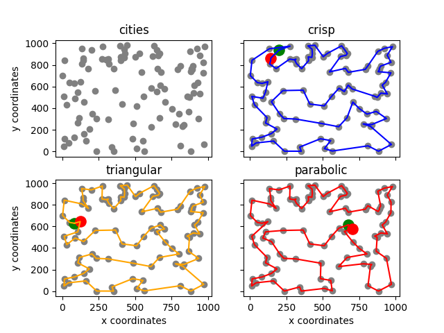

# Fuzzy TSP analyser ∙   

This project is aimed at proving empirically that using fuzzy numbers as a way to measure conceptual distance between cities provides better results than its crisp counterpart (regular tsp), due to uncertainty in realistic conditions that impact aforementioned distance.

# Math base

Current project solves FTSP using an improved version of annealing method – in this case, estimated routes' conceptual distance is presented as a fuzzy number, each having its rank calculated using COG (Center of Gravity) method to be able to be compared and defuzzified.

# Running the project

This repo already contains pre-calculated solutions, as well as problem definitions (original crisp weights are taken from [here](https://tsplib95.readthedocs.io/en/stable/pages/usage.html#loading-problems)).

## Creating virtual environment (optional)

Best practice to run such projects as this it to have a virtual environment set up, I offer using the simplest version, `virtualenv`. You can find instructions on how to set it up online, depending on your platform. If you already have it, run the following command:

    $ virtualenv venv
    
Linux / MacOS:

    $ source venv/bin/activate

Windows:
 
    > venv\Scripts\activate

Once you're done with running this project, you can deactivate the environment:

    $ deactivate
    
## Installing requirements

    $ pip install -r requirements.txt

## Launching code

I advice you to read `help` on your first launch, there you will find a description of all arguments you will need to properly run the script:

    $ python main.py -h

Example:

    $ python main.py --evaluations=10000 --load-best-route --problem=rd100
